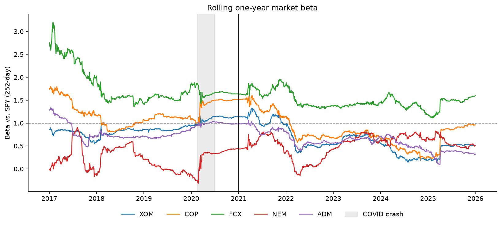
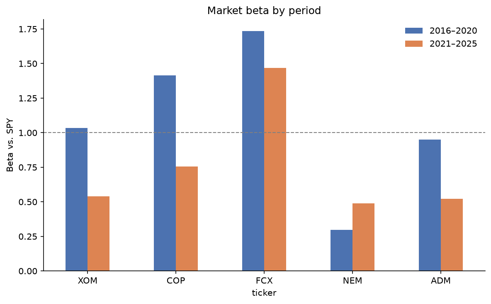
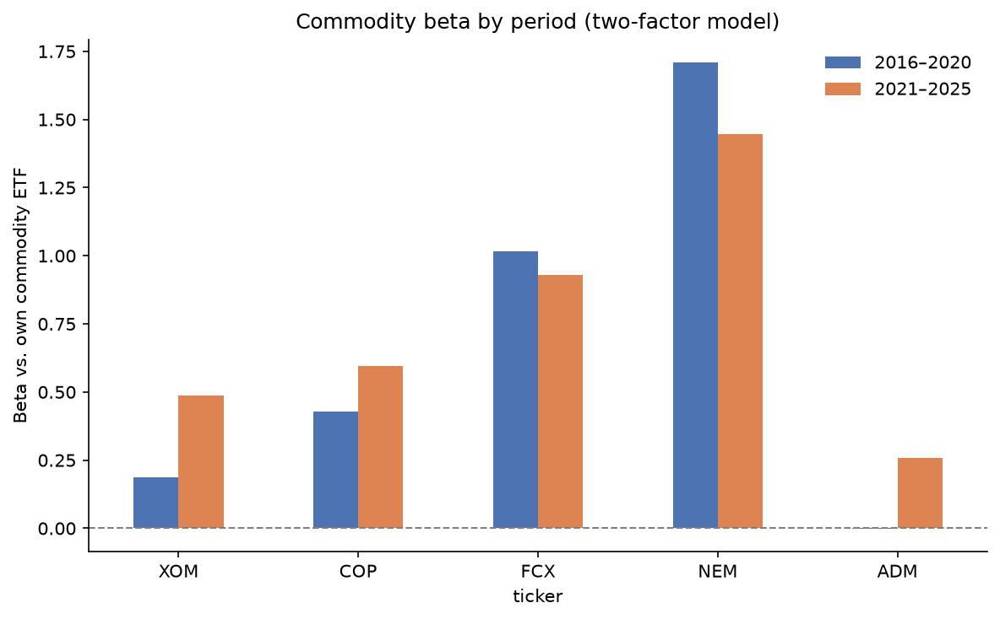

# Commodity-Linked Stocks vs. the S&P 500: Did Market Exposure Change After 2020?

How much of an oil, mining, or agriculture stock's return comes from the stock market, and how much from its commodity? I tested this for five commodity-linked stocks from 2016 to 2025 and checked whether the answer changed after 2020.

**Stocks:** XOM, COP (oil) · FCX (copper) · NEM (gold) · ADM (agriculture)
**Market:** SPY · **Commodities:** USO, CPER, GLD, DBA · **Risk-free rate:** 13-week T-bill (`^IRX`)



## Key findings

1. **Market beta fell for 4 of 5 stocks after 2020, and all four drops are statistically significant.**
   XOM 1.03 → 0.54, COP 1.42 → 0.76, FCX 1.73 → 1.47, ADM 0.95 → 0.52 (pooled interaction test, Newey–West errors, 5% level). FCX's drop is only marginally significant (p = 0.049). NEM was the only stock whose beta rose (0.30 → 0.50), and that change was not significant.
   **When it happened:** the rolling beta shows XOM's and COP's market beta falling sharply in the first half of 2022, from around 1.0–1.2 to about 0.4–0.6, when oil rallied after Russia's invasion of Ukraine while stocks fell on Fed rate hikes. It never returned to pre-2020 levels. FCX is different: most of its lower average comes from an unusually high beta in 2016–2017 (above 2.5). Since 2018 it has stayed mostly between 1.3 and 1.9.
2. **The drop is not just a COVID effect.** Re-estimating the first period on 2016–2019 (excluding 2020) gives the same result: beta is still lower after 2020 for 4 of 5 stocks.
3. **For the oil stocks, oil exposure replaced market exposure.** XOM's oil beta rose from 0.19 to 0.49 and COP's from 0.43 to 0.60, both significant. Adding oil to the model raised XOM's R² by 0.35 after 2020, up from 0.07 before. Over the same period, SPY's R² for XOM fell from 0.46 to 0.12.
4. **NEM behaves like gold, not like a stock.** SPY explains only 2–6% of NEM's daily variation, while adding gold raises R² by about 0.40 in both periods. Its gold beta fell (1.71 → 1.45) but remains the largest commodity exposure in the group.
5. **FCX is the most market-sensitive stock in both periods,** with a stable R² (0.32 → 0.31). This fits copper's role as a growth-sensitive industrial metal.
6. **There is little evidence of alpha.** Only one of ten CAPM alphas is significant (XOM, 2016–2020). With 10 tests at the 5% level, the chance of at least one false positive is about 40%.
7. **Few stocks beat the index on a risk-adjusted basis.** In 2016–2020 only NEM (Sharpe 0.86) beat SPY (0.80). In 2021–2025 XOM (0.96) beat SPY (0.68), and COP (0.69) roughly matched it.

**Takeaway:** a single historical beta is a poor hedge ratio for these stocks. Their market exposure changed significantly after 2020, and for the oil producers, commodity exposure took its place.

## Results

| Stock | Market beta 16–20 | Market beta 21–25 | R² (SPY) 16–20 | R² (SPY) 21–25 | Commodity beta 16–20 | Commodity beta 21–25 |
|---|---|---|---|---|---|---|
| XOM | 1.03 | 0.54 | 0.46 | 0.12 | 0.19 | 0.49 |
| COP | 1.42 | 0.76 | 0.38 | 0.15 | 0.43 | 0.60 |
| FCX | 1.73 | 1.47 | 0.32 | 0.31 | 1.02 | 0.93 |
| NEM | 0.30 | 0.50 | 0.02 | 0.06 | 1.71 | 1.45 |
| ADM | 0.95 | 0.52 | 0.45 | 0.10 | 0.00 | 0.26 |

Full tables are in [`results/`](results/). Commodity betas come from the two-factor model below.

| Market beta by period | Commodity beta by period |
|---|---|
|  |  |

## Method

1. **Data:** daily adjusted prices from Yahoo Finance, saved once to `data/prices.csv` so results are reproducible.
2. **CAPM** on daily excess returns, estimated separately for 2016–2020 and 2021–2025:

   $$r_{i,t} - r_{f,t} = \alpha_i + \beta_i (r_{m,t} - r_{f,t}) + \varepsilon_{i,t}$$

3. **Newey–West (HAC) standard errors** (5 lags), because daily returns have fat tails and clustered volatility.
4. **Beta change test:** both periods pooled, with a post-2020 dummy $D_t$ and an interaction term. $\delta$ measures the change in beta:

   $$r_{i,t} - r_{f,t} = \alpha + \beta x_t + \gamma D_t + \delta D_t x_t + \varepsilon_t$$

5. **Rolling 252-day beta** to show when the change happened.
6. **Two-factor model** adding each stock's own commodity ETF (USO for XOM/COP, CPER for FCX, GLD for NEM, DBA for ADM), with the same pooled test applied to the commodity beta.
7. **Robustness check** excluding 2020.

## How to run

```bash
pip install -r requirements.txt
jupyter notebook commodity_equity_analysis.ipynb   # then Run All
```

The notebook loads `data/prices.csv`. To download fresh data, call `load_prices(refresh=True)`. Results may shift slightly because Yahoo re-adjusts past prices for dividends.

## Repository

```
commodity_equity_analysis.ipynb   analysis
data/prices.csv                   frozen price data
figures/                          charts used in this README
results/                          summary and test tables (CSV)
requirements.txt
```

## Limitations

- USO, CPER, and DBA hold futures, so their returns include roll costs; USO also changed its structure in April 2020.
- Stock returns also reflect company-specific factors such as hedging, costs, and M&A.
- Rolling betas jump when an extreme day enters or leaves the 252-day window. This is visible in March 2020 (the COVID crash entering), March 2021 (the crash leaving), and April 2025 (the tariff sell-off entering).
- Results depend on the chosen split date. The rolling beta reduces this dependence but does not remove it.
- Only daily data and two factors are used. Weekly returns or Fama–French factors would be useful extensions.
